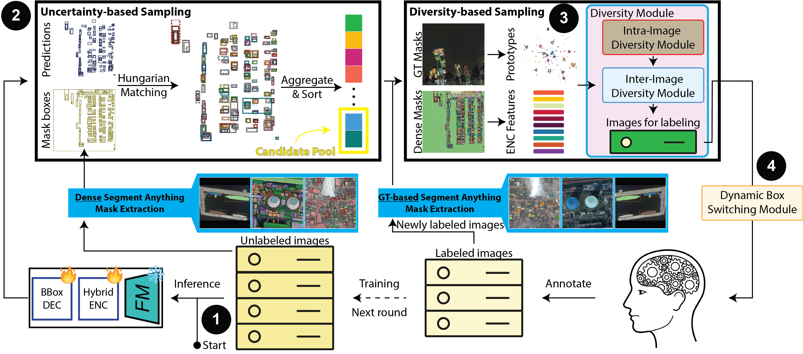
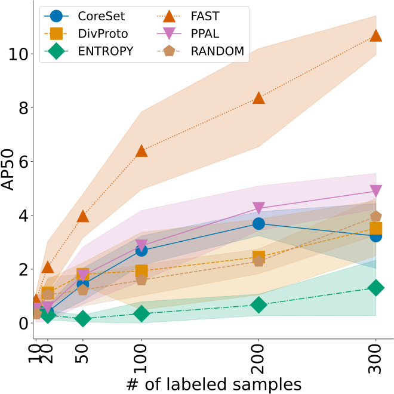
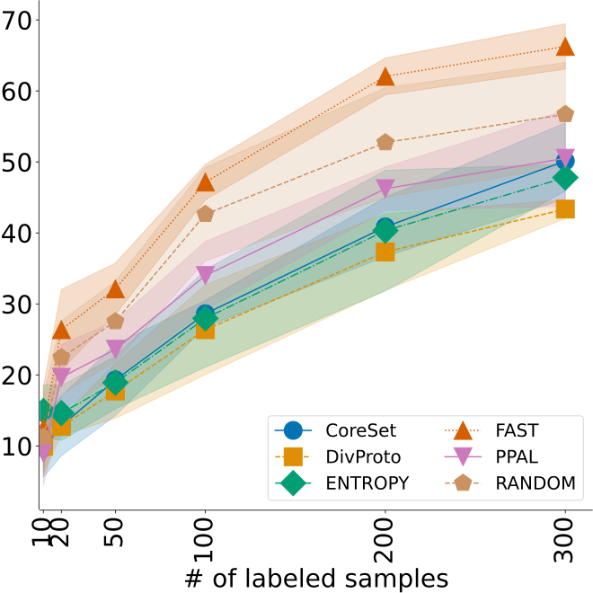
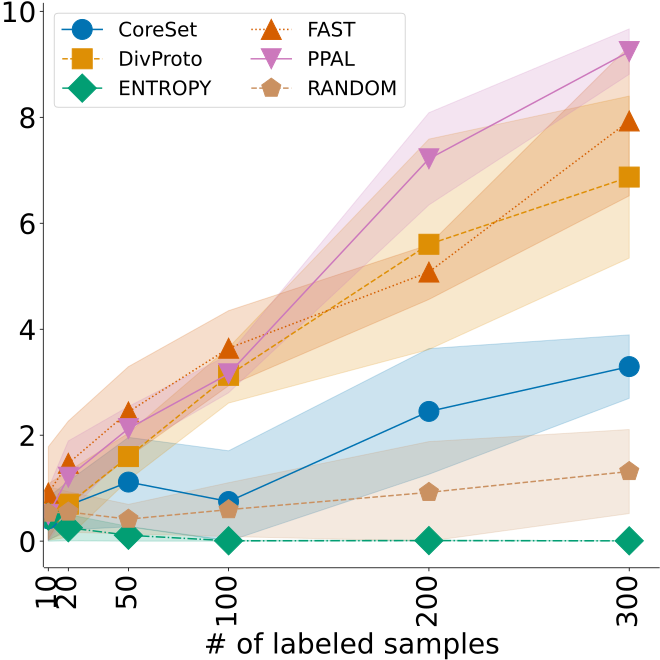
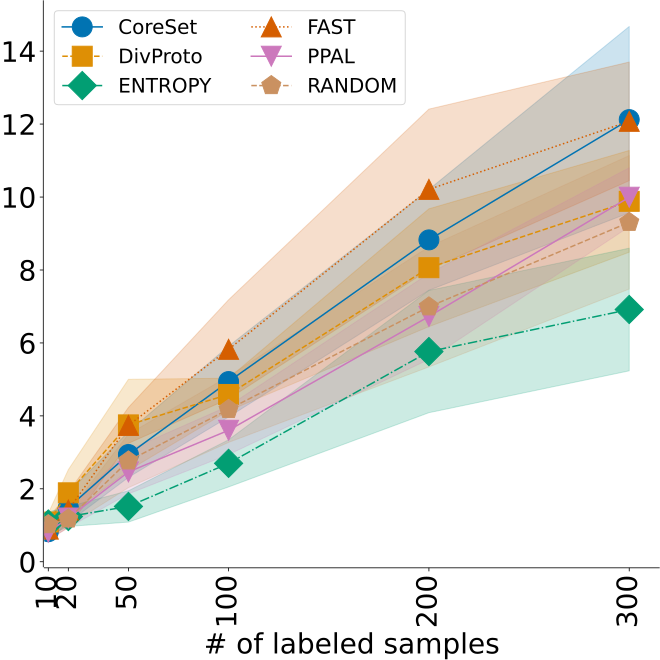
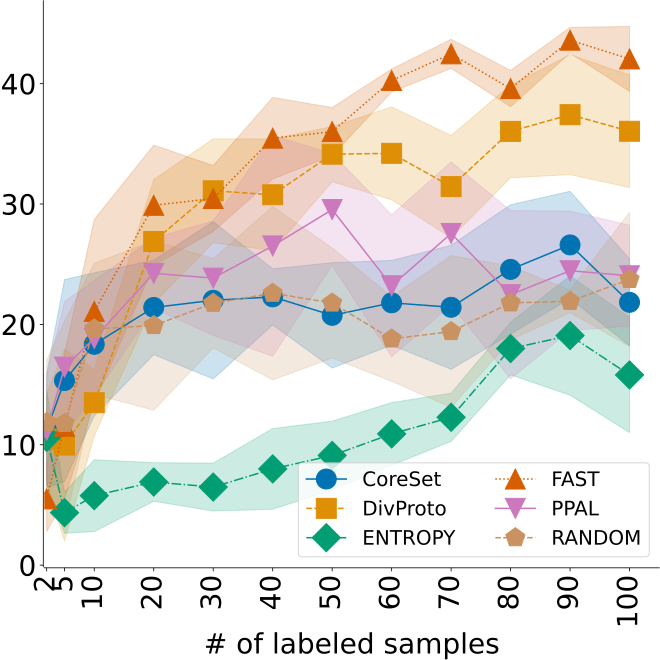

# Active Learning Meets Foundation Models (AL4FM)
This is the repository accompanying the "Active Learning Meets Foundation Models: Fast Remote Sensing Data Annotation for Object Detection" paper accepted at ICCV 2025, the code is released under the MIT license.


Active Learning Meets Foundation Models (AL4FM) is a real-time active learning and semi-automated labeling framework that leverages foundation models to streamline dataset annotation for object detection in remote sensing imagery. For example, by integrating a Segment Anything Model (SAM), our approach generates mask-based bounding boxes that serve as the basis for dual sampling: (a) uncertainty estimation to pinpoint challenging samples, and (b) diversity assessment to ensure broad data coverage. Furthermore, our Dynamic Box Switching Module (DBS) addresses the well-known cold start problem for object detection models by replacing its suboptimal initial predictions with SAM-derived masks, thereby enhancing early-stage localization accuracy.

## User Interface

<div style="display: flex;">
  
</div>

## News

## Installation

Install the conda requirements file in a [**Python>=3.11**](https://www.python.org/) environment.

```bash
conda install TBD
```

## Method

<div style="display: flex;">
  
</div>

## Results

We validate the performance of AL4FM on the DIOR, HRSC2016, DOTAv2, FAIR1M and our private Wafflehome dataset.

<div style="display: flex; justify-content: flex-start;">
  <figure style="width: 20%; text-align: center; margin: 0; padding: 0; box-sizing: border-box;">
    
    <figcaption style="margin-top: 5px; margin-bottom: 0; box-sizing: border-box;">DIOR</figcaption>
  </figure>
  <figure style="width: 20%; text-align: center; margin: 0; padding: 0; box-sizing: border-box;">
    
    <figcaption style="margin-top: 5px; margin-bottom: 0; box-sizing: border-box;">HRSC2016</figcaption>
  </figure>
  <figure style="width: 20%; text-align: center; margin: 0; padding: 0; box-sizing: border-box;">
    
    <figcaption style="margin-top: 5px; margin-bottom: 0; box-sizing: border-box;">DOTAv2</figcaption>
  </figure>
  <figure style="width: 20%; text-align: center; margin: 0; padding: 0; box-sizing: border-box;">
    
    <figcaption style="margin-top: 5px; margin-bottom: 0; box-sizing: border-box;">FAIR1M</figcaption>
  </figure>
  <figure style="width: 20%; text-align: center; margin: 0; padding: 0; box-sizing: border-box;">
    
    <figcaption style="margin-top: 5px; margin-bottom: 0; box-sizing: border-box;">Wafflehome</figcaption>
  </figure>
</div>

## License

Both the front and backend are released under the MIT licence.

## Acknowledgements

Our work is built upon [Segment Anything](https://github.com/facebookresearch/segment-anything), [SAM Geo](https://samgeo.gishub.org/) and [RT-DETR](https://github.com/lyuwenyu/RT-DETR). This research was supported in part by an appointment to the Oak Ridge National Laboratory GRO Program, sponsored by the U.S. Department of Energy and administered by the Oak Ridge Institute for Science and Education.

## Citation

If you find our work useful for you research, please consider citing our upcoming ICCV paper. (TBD)