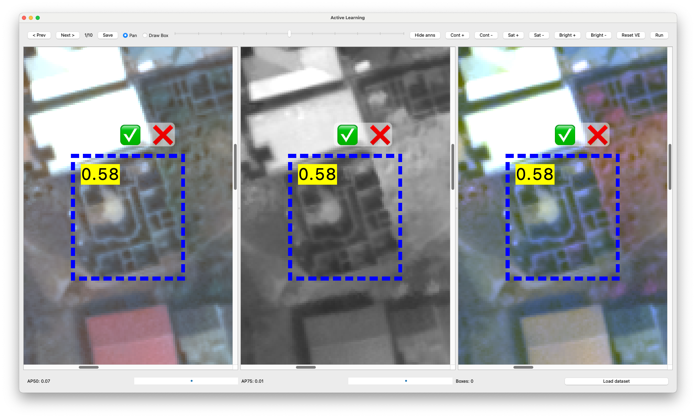

# AL4FM Frontend: Active Learning Image Annotation Tool


## Description

The AL4FM Frontend is a Python/PyQt5 desktop tool for interactive annotation of objects in aerial and satellite imagery using active learning. The tool lets users annotate objects with bounding boxes in either random or smart (active learning) mode and displays real-time performance metrics (AP50, AP75) as annotations accumulate. It is the client-side component of [AL4FM](../README.md); the heavy lifting (training, evaluation, SAM-based mask extraction, active learning sampling) runs on the [backend](../backend/README.md) and is reached over an HTTP API, typically through an SSH tunnel.



## Status

The frontend currently depends on `utils/startup_dialogs.py` (imported at [`main.py:52`](main.py#L52)), which is not yet present in this public release and is being restored from the original lab checkout. Until it is restored, `python main.py` will fail at import time. The rest of the frontend is complete and runnable.

## Features

- Interactive detection and annotation of objects in aerial and satellite imagery
- Two annotation modes: Random and Active Learning (smart)
- Support for positive and negative samples via bounding boxes
- Real-time performance metrics (AP50, AP75) visualization
- Multiple dataset management with dataset synchronization
- Image normalization and enhancement controls
- Support for creating new datasets from TIF files
- User activity logging for performance analysis
- Pan / draw interaction modes
- Confidence filtering for predicted annotations
- Support for various image formats: JPG, PNG, TIFF

## Layout

```
frontend/
├── main.py                           # Application entry point (MainWindow)
├── environment.yml                   # Conda environment for the frontend
├── requirements.txt                  # Pip-only extras installed by environment.yml
└── utils/
    ├── dataset_sync_dialogs.py       # Dataset wizard (upload, tile, extract dense masks)
    ├── interactive_bounding_box.py   # Canvas, interactive boxes, plot widget
    ├── synced_graphicsview.py        # Pan/zoom-synced QGraphicsView
    └── task_worker.py                # Background worker for long-running HTTP calls
```

- `datasets/` — at runtime, imported TIFs and COCO datasets live here; the frontend creates tiles under `datasets/<name>/images/` and stores `annotations.json` alongside.
- `logs/` — per-user activity logs (JSONL) are written here.

## Prerequisites

- Python 3.11 or higher
- Anaconda or Miniconda
- A working Qt5 runtime (installed automatically by the conda environment)
- SSH access to the AL4FM backend (a CUDA-capable server with >= 8 GB VRAM, see [`backend/README.md`](../backend/README.md))

The frontend itself does not need a GPU.

## Installation
Clone the repository:
```
git clone https://github.com/mburges-cvl/ICCV_AL4FM/tree/main/frontend
cd alfrontend
```

From the repository root:

```bash
cd frontend
conda env create -f environment.yml
conda activate al4fm-frontend
```

This installs NumPy, Pillow, rasterio, matplotlib, requests and PyQt5 from conda-forge. The `requirements.txt` file is a placeholder for any pip-only extras and is currently empty.

## Usage

Start the backend on the server (see [`backend/README.md`](../backend/README.md)), then open an SSH tunnel from the annotator workstation so that `localhost:<port>` on your machine maps to the backend's FastAPI port:

```bash
ssh -N -L 8005:localhost:8005 user@server_address
```

The tunnel port must match the `--port` you started the backend with and the port you enter in the frontend's startup wizard. Launch the application:

```bash
conda activate al4fm-frontend
python main.py
```

The startup wizard collects the server port, username, dataset, and object class, and then launches the main annotation window.

## Workflow

1. Start the application and follow the setup wizard.
2. Select or create a dataset. New TIFs are automatically tiled and (optionally) have dense SAM masks extracted on the server.
3. Choose an object class to annotate.
4. Use the draw tool to create positive (and optional negative) bounding boxes.
5. Trigger training / active learning rounds from the sidebar — the frontend calls the backend and updates the metrics plot.
6. Save annotations when complete.

## Dataset Management

- Use existing datasets from the `datasets/` directory.
- Create new datasets from TIF files via the dataset wizard; tile size, overlap and class metadata are configured there.
- Synchronize datasets between local and remote server through `utils/dataset_sync_dialogs.py`, which uploads files chunk by chunk and then triggers SAM mask extraction on the backend.

## Tile Size

The backend pipeline is tuned for 1024×1024 tiles. Datasets sampled at a different square size — for example DIOR at 800×800 — are automatically resized and padded to 1024×1024 when imported through the dataset wizard. Non-square tiles are not supported; if your source tiles are not square you need to re-tile them before importing.

## Results Analysis

The tool records user activity for further analysis. Results can be found in:

- `logs/` — user activity logs in JSONL format (`user_activity_log_<username>_localhost:<port>.jsonl`)
- `annotations_<username>_localhost:<port>.json` — exported COCO-style annotations

## Known Issues

- Only supports a single class at a time for annotation (the model and active learning method themselves support multi-class).
- SAM mask extraction on large datasets is slow. If it is cancelled before completion, the server may be left without the expected mask files; delete the partial `.npy` files under `datasets/<name>/` and rerun the extraction.
- Uses Weights & Biases inside the vendored trainers. Set `wandb: false` in your RT-DETR / RF-DETR config (or leave `WANDB_MODE=offline`) if you do not want cloud logging.
- The current experiment loop trains and validates on the same set — expect optimistic metrics.
- The dataset and class selection should remain consistent within a session; changing them mid-session will not migrate existing annotations.

## License

This project is licensed under the MIT License — see [LICENSE](../LICENSE).
